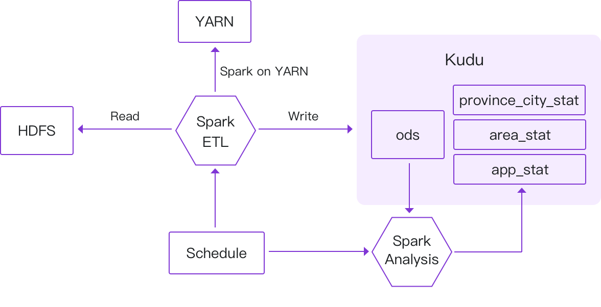
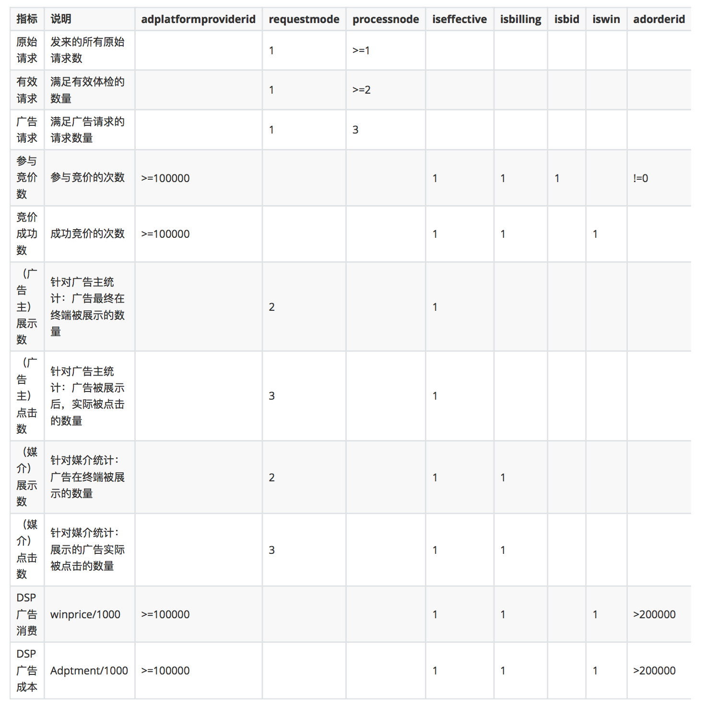
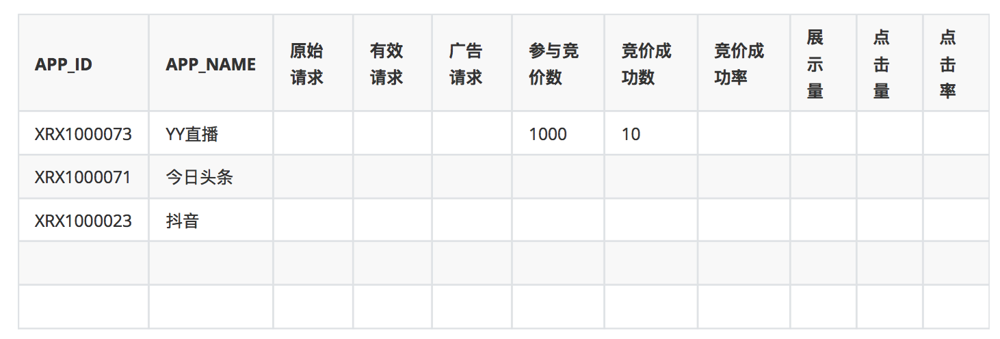

# SparkSQL极速入门 整合Kudu实现广告业务数据分析

## 项目架构与流程



使用Kudu整合Spark进行广告业务功能的实现，并针对已实现的需求代码进行调优。


### 统计逻辑





## 执行

```bash
$ mvn package 
$ scp target/sparksql-train-1.0.jar yhost:~/libs/ 
```

```bash
$ scp ~/.m2/repository/org/apache/kudu/kudu-spark2_2.11/1.7.0/kudu-spark2_2.11-1.7.0.jar yhost:~/libs/
$ scp ~/.m2/repository/org/apache/kudu/kudu-client/1.7.0/kudu-client-1.7.0.jar yhost:~/libs/
$ scp -r ./data yhost:~/libs/

$ ssh yhost 

$ cd ~/libs/
$ hadoop fs -mkdir -p /pk/access/20181007
$ hadoop fs -put data/data-test.json /pk/access/20181007/
$ hadoop fs -put data/ip.txt /pk/ip.txt
```

### 核心应用 SparkApp

com.yourtion.bigdata.c08.SparkApp

```bash
${SPARK_HOME}/bin/spark-submit \
    --class com.yourtion.bigdata.c08.SparkApp \
    --master local \
    --jars kudu-client-1.7.0.jar,kudu-spark2_2.11-1.7.0.jar \
    --conf spark.time=20181007 \
    --conf spark.raw.path="hdfs://yhost:8020/pk/access/20181007" \
    --conf spark.ip.path="hdfs://yhost:8020/pk/ip.txt" \
    sparksql-train-1.0.jar
```